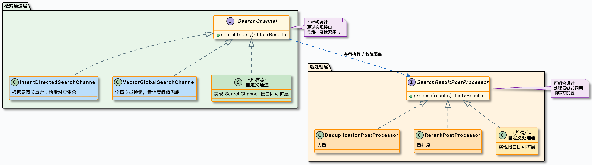
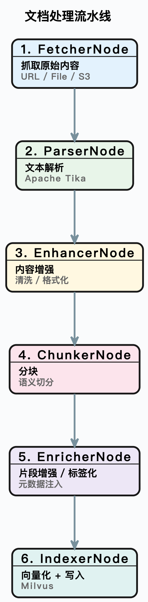
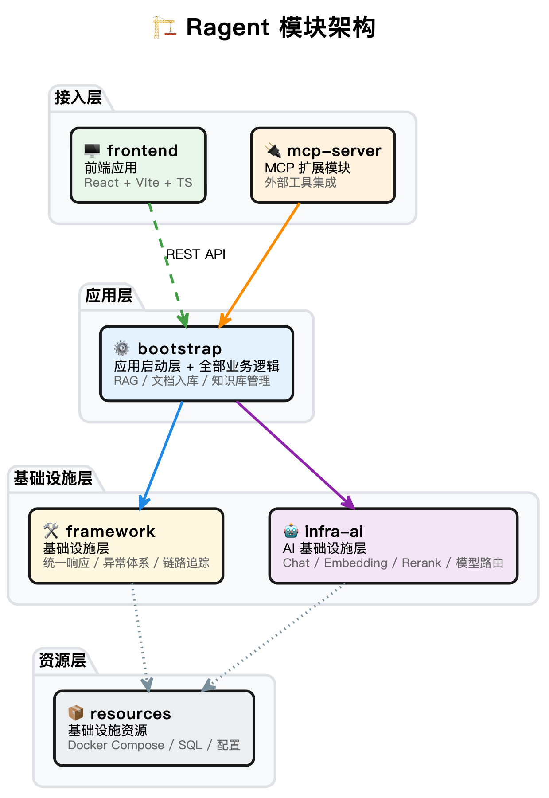

# Ragent


> 面向工业设备运维场景的多模态 RAG 智能问答平台：文本、图纸、扫描件联合解析，意图 / 向量 / 图像 / 超图四路混合检索，回答附带可溯源引用。


## 项目简介

针对工业资料异构、知识分散、故障处置依赖专家经验与人工翻阅的痛点，Ragent 基于 **Java 17 + Spring Boot 3 + React 18** 构建了覆盖「知识构建 → 问答生成」完整闭环的多模态 RAG 平台：

- **看得懂图纸**：PDF 逐页解析，电子页走 PDFBox、扫描页走 OCR、图纸走 Qwen-VL 视觉语义描述；
- **查得到关系**：自研 N 元超图推理引擎，跨文档多跳关系问答，弥补纯向量检索"只认相似、不懂关系"的短板；
- **答得有依据**：SSE 流式输出，引用以「文本卡片 / 图纸大图 / 推理路径」三类结构化呈现，答案可溯源、可验证。

## 核心特性

| 特性 | 说明 |
|------|------|
| 多模态文档理解 | PDF / Word / Markdown / 图纸扫描件联合解析，Tika + PDFBox + Tesseract OCR + Qwen-VL 图像语义 |
| 多路混合检索 | 意图定向 / 全局向量 / 图像语义 / 超图四通道并行，后处理链「去重 → 多源加权融合 → Rerank」 |


| 超图推理引擎 | N 元超边建模（设备 / 工况 / 参数 / 故障 / SOP），实体→超边倒排索引 O(k) 子图匹配，读写锁并发安全 |
| 查询重写 | 多轮对话上下文补全、口语噪声规范化，解决"说的不是想问的" |
| 意图识别与路由 | 树形多级意图体系（领域→类目→话题），置信度不足时主动引导澄清 |
| 模型路由与容错 | 多供应商候选 + 优先级调度 + 首包探测 + 三态熔断降级，单模型故障无感切换 |
| 文档入库 ETL | 节点可视化编排 Pipeline，任务幂等 + 检查点恢复 + 租约控制，长耗时入库可断点续跑 |


| 可溯源回答 | 检索结果结构化 references，SSE 先发引用再发正文，前端分类型渲染 |
| 全链路追踪 | 重写 → 意图 → 检索 → 生成全环节 Trace，基于 AOP + TTL 跨线程透传 |
| 企业级工程 | Redisson 分布式排队限流、Sa-Token 认证、MCP 工具集成、会话记忆压缩 |

## 技术栈

| 分类 | 技术 |
|------|------|
| 后端 | Java 17、Spring Boot 3.5、MyBatis-Plus、Sa-Token、Spring AI |
| 向量/检索 | Milvus 2.6（文本 / 图像双集合）、pgvector、多模态 Embedding、Rerank |
| 多模态 | Apache Tika、PDFBox、Tesseract OCR、Qwen-VL 图像语义解析 |
| 图推理 | JGraphT、自研 N 元超边模型 |
| 中间件 | PostgreSQL、Redis（Redisson）、RocketMQ、RustFS（S3） |
| AI 模型 | SiliconFlow Qwen3-32B / Qwen3-Embedding-8B / Qwen3-Reranker-8B（云端路由 + 本地降级） |
| 前端 | React 18、TypeScript、Vite、Tailwind、Radix UI、Zustand、SSE |
| 工程 | Maven 多模块、Spotless、Docker Compose 一键部署 |

## 评测结果

> 数据取自固定受控评测集（R5 总评测），详情与复现口径见 [评测结论](ragent/docs/eval/r5-restricted-conclusions.md)。

| 指标 | 结果 |
|------|------|
| 检索质量（240 条工业主集） | 微平均 Hit@1 **63.83%**、MRR **0.6944**、P95 **14.7s** |
| 分层 Hit@1 | 文本 86.67% / 超图关系 73.47% / 图像 37.5%（当前瓶颈） |
| 查询重写（严格配对 A/B） | 多轮指代 MRR 0.48 → 0.89（**+84.6%**）；噪声难例 Hit@1 0% → **45%** |
| 图像检索（100 条专项全链路） | Hit@5 **67.39%**、MRR 0.4745，铭牌手册 Hit@1 56.52% |
| 超图关系（留出测试集） | Recall@5 **100%**、严格推理路径命中 **91.3%** |
| 生成质量（60 条 RAGAS） | 答案忠实度 0.61 / 上下文召回 0.67 / 上下文精准 0.63 |

## 快速开始

### 方式一：Docker Compose 一键启动（推荐）

全部服务（PostgreSQL / Redis / RocketMQ / Milvus 全家桶 / 后端 / 前端）容器化，一条命令拉起：

```bash
# 1. 配置环境变量（至少需要 LLM API Key）
cp .env.example .env
# 编辑 .env，填入 SILICONFLOW_API_KEY

# 2. 一键启动（首次需构建镜像，耗时较长）
docker compose up -d --build

# 3. 访问前端：http://localhost:5177（默认账号 admin / admin）
```

> [!TIP]
> 数据库初始化、Milvus 集合创建、演示数据入库（FAQ 210 条 / 设备图纸 12 张 / 超图超边 633 条）均由编排自动完成，无需手动干预。Windows 用户也可直接双击根目录 `start-ragent.bat`。

### 方式二：本地开发模式

```bash
# 1. 先启动中间件
docker compose up -d postgres redis rocketmq-namesrv milvus

# 2. 启动后端（端口 9090，context-path /api/ragent）
cd ragent
./mvnw spring-boot:run -pl bootstrap

# 3. 启动前端（开发服务器，自动代理 /api 到后端）
cd ragent/frontend
npm install
npm run dev
```

### 环境变量

| 变量 | 必填 | 说明 |
|------|------|------|
| `SILICONFLOW_API_KEY` | 是（默认） | SiliconFlow API Key（Chat / Embedding / Rerank / Vision） |
| `BAILIAN_API_KEY` | 否 | 可选百炼适配器密钥，在 `application.yaml` 启用候选后生效 |
| `PHASE5_INGEST` | 否 | 首次启动是否自动全量入库演示数据，默认 `true` |

## 项目结构

后端采用前后端分离架构，后端按职责拆分为四个 Maven 模块：

| 模块 | 职责 |
|------|------|
| `bootstrap` | 启动入口与业务承载：RAG 检索、超图引擎、知识库、入库 Pipeline、用户中心、管理后台 |
| `framework` | 无业务横切能力：三级异常体系、统一响应、SSE 封装、分布式 ID、幂等、Trace 上下文、MQ 封装 |
| `infra-ai` | AI 基础设施：Chat / Embedding / Rerank 客户端，多供应商路由与故障切换 |
| `mcp-server` | 独立 MCP 服务器（端口 9099）：JSON-RPC 协议、工具注册与分发 |



前端为独立项目：`frontend`（React 18 + Vite + TypeScript + Tailwind），覆盖聊天页、管理后台、个人中心。

```
agent/
├── docker-compose.yml      # 一键容器化编排
├── .env.example            # 环境变量示例
├── ragent/
│   ├── bootstrap/          # 后端业务模块
│   ├── framework/          # 基础设施模块
│   ├── infra-ai/           # AI 基础设施模块
│   ├── mcp-server/         # MCP 服务器
│   ├── frontend/           # React 前端
│   ├── data/               # 演示数据（FAQ / 超图 / 图纸）
│   ├── docs/               # 项目文档
│   └── scripts/eval/       # 评测脚本与报告
└── docs/                   # 快速启动指南
```

## 文档导航

- [📚 文档总索引](DOCUMENTATION.md) — 全部文档按用途分类导航
- [架构文档](ragent/docs/architecture.md) — 系统全景、模块划分、数据流、扩展点
- [API 文档](ragent/docs/api.md) — REST 接口、SSE 协议、LLM 路由、Milvus Schema
- [部署指南](ragent/docs/deployment.md) — 一键容器化部署与生产配置
- [评测结论](ragent/docs/eval/r5-restricted-conclusions.md) — R5 总评测权威结论与复现口径
- [演示 Query 集](ragent/docs/demo_queries.md) — 5 个典型工业问题

## License

本项目基于 [Apache License 2.0](ragent/LICENSE) 开源。
