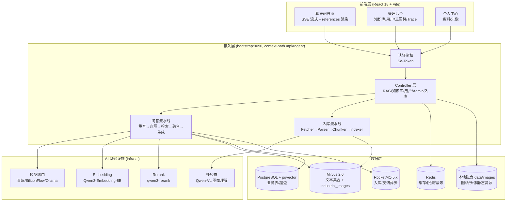

# Ragent 架构文档

> Ragent 是一个企业级 **Agentic RAG 智能体平台**,基于 Java 17 + Spring Boot 3 + React 18 构建,面向工业/制造场景完成**多模态 RAG 升级**:文本、图像、超图三路检索,answers 附带可溯源的 references。

## 1. 系统全景



## 2. 模块划分

后端采用前后端分离 + 后端四 Maven 模块的分层结构:

| 模块 | 职责 |
|------|------|
| **bootstrap** | 启动入口与业务承载:多模态 RAG 检索、超图引擎、知识库、入库 Pipeline、用户中心、管理后台。依赖 framework + infra-ai |
| **framework** | 无业务横切能力:三级异常体系、统一响应、SSE 封装、分布式 ID、幂等、Trace 上下文、MQ 封装、MyBatis 公共字段 |
| **infra-ai** | AI 基础设施:ChatClient / EmbeddingClient / Rerank 客户端,多模型供应商路由(百炼 / SiliconFlow / Ollama)与故障切换 |
| **mcp-server** | 独立 MCP 服务器(端口 9099):JSON-RPC 协议、工具注册与分发、业务工具执行器 |
| **frontend** | React 18 + Vite + TS + Tailwind + Radix UI:聊天页、管理后台、个人中心 |

## 3. 核心数据流

### 3.1 提问问答链路(SSE)

```
用户提问 ──> GET /rag/v3/chat (SSE)
  ├─ 查询改写(多轮上下文补全/复杂问题拆分)
  ├─ 意图识别与路由(树形意图体系)
  ├─ 多通道并行检索:
  │    ├─ 意图定向检索(IntentDirectedSearchChannel)
  │    ├─ 向量全局检索(VectorGlobalSearchChannel)
  │    ├─ 图像语义检索(ImageSearchChannel, Milvus industrial_images)
  │    └─ 超图推理检索(HyperGraphSearchChannel, 本地倒排索引)
  ├─ 后处理链:去重 → 多源加权融合 → Rerank
  ├─ 上下文组装(Prompt) + LLM 流式生成(模型路由/降级)
  └─ SSE 事件流:meta → references → message* → finish → done
```

### 3.2 文档入库链路(Ingestion Pipeline)

```
上传/抓取 ──> IngestionEngine(节点编排)
  ├─ FetcherNode(拉取字节流)
  ├─ ParserNode(Tika 解析 PDF/Word/Markdown)
  ├─ MultimodalDocumentParserNode(OCR 扫描件 / Qwen-VL 图像描述 / 图纸增强)
  ├─ EnricherNode / EnhancerNode(语义富化与增强)
  ├─ ChunkerNode(按策略分块)
  └─ IndexerNode(向量化 + 批量写 Milvus)

并行旁路:
  └─ 超图抽取(LLM 抽取 N 元超边 → data/hypergraph/hyperedges.jsonl → 启动时加载进内存倒排索引)
```

### 3.3 多模态图像链路

```
设备图纸/现场照片
  ├─ PDFBox(电子 PDF 文本/表格)
  ├─ Tesseract OCR(扫描件文字)
  └─ Qwen-VL(图像语义描述,工业引导 Prompt)
        └─ 描述文本 Embedding → Milvus industrial_images 集合
用户提问时:query 向量化 → industrial_images 检索 → 命中后返回图纸 URL(/files/** 静态资源)+ 描述片段
```

## 4. 多模态 RAG 设计

### 4.1 图像解析

`multimodal.parser` 包提供三种互补解析器,由 `MultimodalDocumentParser` 统一编排:

| 解析器 | 技术 | 适用 |
|--------|------|------|
| `PdfBoxParser` | Apache PDFBox | 电子 PDF 文本/表格 |
| `Tess4JParser` | Tesseract OCR | 扫描件、图纸文字 |
| `QwenVLImageParser` | 百炼 DashScope Qwen-VL | 图纸/照片语义描述(工业引导 Prompt) |

### 4.2 图像检索通道

`ImageSearchChannel`(优先级 20)与文本通道并行:query 向量化后在 Milvus `industrial_images` 集合检索 Qwen-VL 生成的图像描述。命中结果的 `image_path` 映射为 `/files/**` 静态资源 URL,作为 IMAGE 类型引用随 SSE 输出。

### 4.3 超图引擎

`rag.core.hypergraph` 包:

- **超边模型 `HyperEdge`**:工业 N 元关系事实单元(设备 / 工况 / 参数 / 故障 / SOP 5 核心字段 + 扩展实体)。
- **抽取 `HyperEdgeExtractor`**:LLM 从文档抽取超边,`EntityExtractor` 从 query 抽取实体集合。
- **索引与推理 `IndustrialHyperGraphImpl`**:基于倒排索引(`实体值 → 超边下标`)做子图匹配,读写锁保障并发。
- **检索通道 `HyperGraphSearchChannel`**(优先级 30):实体抽取 → 倒排索引匹配 → 超边展开为推理路径文本,输出 HYPERGRAPH 类型引用。

超图解决了纯向量检索"只认相似、不懂关系"的短板:如"油泵 → 密封圈 → 装配扭矩"这类跨文档多跳关系。

### 4.4 多路融合与 Rerank

| 通道 | 优先级(数值) | 来源 |
|------|:--:|------|
| IntentDirectedSearchChannel | 最高(=1) | 意图定向(最精确) |
| VectorGlobalSearchChannel | 10 | 向量全局兜底 |
| ImageSearchChannel | 20 | 图像语义 |
| HyperGraphSearchChannel | 30 | 超图关系 |

后处理链(order 升序):`Deduplication(去重)` → `MultiSourceFusion(按 source 分组 min-max 归一化 + 权重加权, order=9)` → `Rerank(模型重排, order=10)`。权重通过 `ragent.fusion.weights` 配置。

### 4.5 references 结构化输出

`StreamChatPipeline.buildReferences()` 将检索 Chunk 转换为 `Reference(type/label/url/detail/snippet/extra)` 列表,在 LLM 流开始前经 `onReferences` 回调发出。`ReferenceType` 枚举:TEXT / IMAGE / HYPERGRAPH,前端按类型分别渲染文本引用卡、图纸 Lightbox、推理路径。

## 5. 工程基础能力(framework)

| 能力 | 实现 |
|------|------|
| 统一返回 | `Result` / `Results`,统一错误码规范 |
| 异常体系 | `AbstractException` → `ClientException` / `ServiceException` / `RemoteException` |
| 全局异常处理 | `GlobalExceptionHandler`(含 404 明确提示) |
| SSE 封装 | `SseEmitterSender`(线程安全、CAS 关闭、JSON 透传) |
| 分布式 ID | Snowflake(Redis Lua 注册 workerId) |
| 幂等 | 提交端/消费端 AOP 幂等 |
| 链路追踪 | `RagTraceContext` + AOP,TTL 跨线程透传 |
| 用户上下文 | `UserContext` / `LoginUser` |
| MQ 封装 | RocketMQ 生产者 + 事务消息 |
| 限流 | Redisson 信号量 + ZSET 排队(Lua)+ Pub/Sub 唤醒,SSE 推送排队状态 |
| 熔断/降级 | 模型健康状态 + 优先级降级链(模型路由层) |

## 6. 扩展点

面向接口设计,新增能力零框架改动:

| 扩展点 | 接口 | 说明 |
|--------|------|------|
| 新增检索通道 | `SearchChannel` | 注册为 Spring Bean 自动生效 |
| 新增后处理器 | `SearchResultPostProcessor` | 自动加入处理链 |
| 新增入库节点 | `IngestionNode` | 可插入 Pipeline 任意位置 |
| 新增模型供应商 | `ChatClient`(infra-ai) | 配置候选列表即可参与路由 |
| 新增 MCP 工具 | `MCPToolExecutor` | 被 `DefaultMCPToolRegistry` 自动发现 |
| 新增意图节点 | `IntentNodeRegistry` | 注册表自动发现 |

## 7. 数据模型

### PostgreSQL(pgvector)

20+ 张业务表:用户、会话、消息、知识库、文档、Chunk、意图树、入库流水线、链路追踪等。超图事实单元(超边)由 `data/hypergraph/hyperedges.jsonl` 在应用启动时加载进内存引擎(`Phase5HyperEdgeLoader`),不落业务表。

### Milvus 2.6

| 集合 | 用途 | Schema |
|------|------|--------|
| `rag_default_store` / 各知识库独立集合 | 文本向量 | `id`(VarChar 主键) / `content`(VarChar 65535) / `metadata`(JSON) / `embedding`(FloatVector, 4096 维) |
| `industrial_images` | 图像语义(图纸描述文本) | 同上 4 列结构 |

索引:HNSW,metric `COSINE`。向量库类型可通过 `rag.vector.type` 在 milvus / pg 间切换。

### 静态资源

`/files/**` → `file:data/images/`(配置化),承载图纸引用图片与用户头像(`data/images/avatars/`)。
